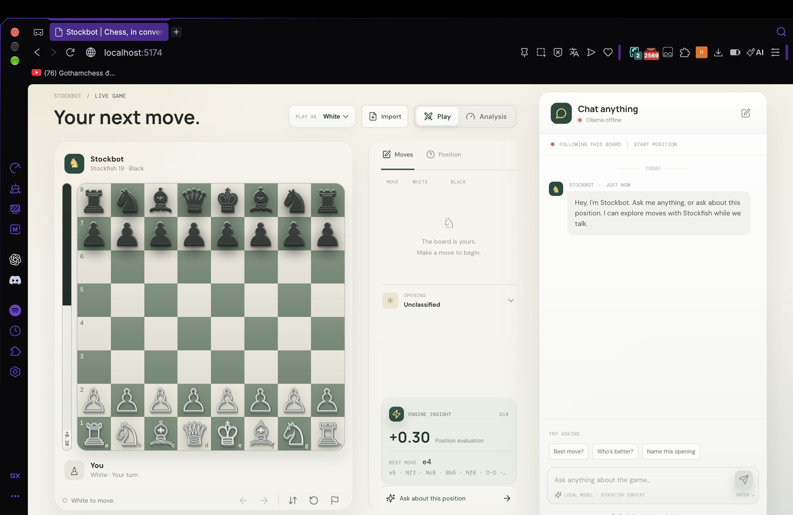

<div align="center">

# ♞ MateMind

### Make a move. Find an idea. Enjoy the game.

Your chessboard, Stockfish 19, game review, and optional local chat—all in one friendly workspace.

[](https://github.com/vuminhnhat880-code/Mate-Mind/actions/workflows/ci.yml)
[](https://github.com/vuminhnhat880-code/Mate-Mind/actions/workflows/deploy-pages.yml)
[](https://stockfishchess.org/)
[](https://nodejs.org/)
[](LICENSE)

[](https://vuminhnhat880-code.github.io/Mate-Mind/)
[](#start-here)

<br><br>

<a href="https://vuminhnhat880-code.github.io/Mate-Mind/">
  
</a>

<sub>Click the preview to open the live board · No account needed</sub>

</div>

> **A quick heads-up:** the online preview includes the full Stockfish engine in single-thread mode. Want multithreaded analysis or optional chat? Run MateMind locally; Ollama chat needs [Ollama](https://ollama.com/) on your computer.

<details>
<summary><strong>🧭 Find your way around</strong></summary>

[Start here](#start-here) · [Play](#play) · [Explore](#analysis) · [Game Review](#review) · [FEN & PGN](#imports) · [Chat](#chat) · [Development](#developers) · [Privacy](#privacy)

</details>

## ♟️ Your board, your way

<table>
<tr>
<td width="33%" valign="top">

### 🥊 [Play](#play)

Choose your color and take on Stockfish. Click, drag, or navigate with your keyboard—then [undo, redo, and try another idea](#play-a-game).
<p><sub><a href="#play-a-game">Jump into a game →</a></sub></p>
</td>
<td width="33%" valign="top">

### 🔎 [Explore](#analysis)

Follow real engine evaluations, compare candidate lines, import a position, and see how the move sequence unfolds.
<p><sub><a href="#analysis">Explore a position →</a></sub></p>
</td>
<td width="33%" valign="top">

### 💬 [Learn](#review)

Review a game move by move. Ask about the board, or add an optional Ollama model for local general chat.
<p><sub><a href="#review">Review a game →</a> · <a href="#chat">Chat with MateMind →</a></sub></p>
</td>
</tr>
</table>

<p align="center"><sub>Built with React, TypeScript, chess.js, and Stockfish 19 · Optional local chat with Ollama</sub></p>

<a id="start-here"></a>

## 🚀 Get started

### The easy route: one setup script

Our setup script does the busywork: it checks prerequisites, installs project packages, starts Ollama if needed, downloads its model, builds MateMind, and starts the local server.

> **Before you start:** use Node.js **22.13+** and npm. Optional chat downloads `qwen3:1.7b` (about **1.4 GB**), so leave a few gigabytes free. Review installer prompts before approving them.

**1 · Get the project**

```sh
git clone https://github.com/vuminhnhat880-code/Mate-Mind.git
cd Mate-Mind
```

**2 · Pick your setup**

| 🍎 macOS | 🐧 Linux | 🪟 Windows 10/11 |
|---|---|---|
| `bash setup.sh` | `bash setup.sh` | `powershell.exe -ExecutionPolicy Bypass -File .\setup-windows.ps1` |

Windows already includes **Windows PowerShell**—no need to install PowerShell 7. The Windows setup script uses **`winget`**. If it isn't available, follow the manual steps below instead.

**3 · Make yourself at home**

When setup finishes, open the local address printed in the terminal (usually **http://localhost:5173**). Leave that terminal open while playing; **Ctrl+C** stops the server.

<details>
<summary><strong>Prefer to set things up by hand?</strong></summary>

Install Node.js 22.13+ with npm. To enable general chat, install [Ollama](https://ollama.com/) too. In the project folder, run:

```sh
npm ci
ollama pull qwen3:1.7b
```

Start Ollama in one terminal (only needed for general chat):

```sh
ollama serve
```

In another terminal, start MateMind:

```sh
npm run dev
```

Open the local URL Vite prints. The board and chess engine work without Ollama.

</details>

<a id="play"></a>

## ♜ Make your first moves

<a id="play-a-game"></a>

### 🥊 Play a game

1. Choose **Play** and pick White or Black.
2. Click a piece and a legal destination, drag a piece, or use the keyboard to navigate the board.
3. Stockfish replies. If you choose Black, Stockfish opens as White.
4. Use **Undo**, **Redo**, and **Flip board** to make the game your own.

Legal moves are handled by `chess.js`. When a pawn reaches the far rank, choose a queen, rook, bishop, or knight—your pawn, your promotion.

<a id="analysis"></a>

### 🔎 Explore a position

Choose **Analysis** to explore any legal continuation. Make a move or jump to a point in the timeline; the engine evaluation and best-move arrow follow the selected position. In this mode, Undo and Redo move one ply at a time.

Scores use **White's perspective**:

- A positive centipawn score favors White; a negative score favors Black.
- `M3` is a forced mate for White; `M-3` is a forced mate for Black.
- The evaluation bar and graph show engine advantage—not win probability.

Think of an evaluation as a helpful lens, not a promise. Search time, hardware, and browser memory all affect what Stockfish can see.

<a id="engine-settings"></a>

### ⚙️ Tune the engine

Open **Engine settings** in the position panel. Settings are validated, bounded, and saved in your browser's local storage.

| Setting | Available values | What it changes |
|---|---:|---|
| Depth | 8–40 plies | Search depth for position analysis |
| Move time | 250–15,000 ms | Time budget for Stockfish's reply in Play mode |
| Threads | 1–16 | Worker threads when the host supports cross-origin isolation |
| Hash | 64–2,048 MB | Memory allocated to the engine's transposition table |
| MultiPV | 1, 2, 3, or 5 | Candidate lines shown during analysis |

More time, threads, and hash can use more CPU, memory, and battery. Without cross-origin isolation, MateMind automatically uses full-strength single-thread Stockfish; the Threads setting is disabled. Game Review searches are capped at depth 14. Select **Stop analysis** whenever you'd like to pause a search.

<a id="review"></a>

### 📝 Review a game

Played a game or loaded a PGN? Select **Review** and MateMind will go through the current line one position at a time. Watch its progress, or cancel whenever you like; cancelling clears partial results and returns to live analysis.

The review includes:

- A final-position evaluation and a count of analyzed moves.
- A move-by-move classification, estimated centipawn loss, and evaluation change.
- A rough estimated-accuracy percentage and counts for each category.
- Links that take you back to the position after a reviewed move.

> **Friendly reminder:** these labels are engine-based heuristics, not official ratings or objective judgments. “Brilliant” is intentionally rare; estimated accuracy is based on average centipawn loss, not a probability.

<a id="imports"></a>

### 📥 Import FEN or PGN

1. Select **Import**.
2. Choose **FEN position** or **PGN game**.
3. Paste your notation and select **Load**.

FEN must contain all six fields—board, turn, castling rights, en-passant square, halfmove clock, and fullmove number. For example, the starting position is:

```text
rnbqkbnr/pppppppp/8/8/8/8/PPPPPPPP/RNBQKBNR w KQkq - 0 1
```

PGN headers are retained, including custom starting positions using `[SetUp "1"]` and `[FEN "..."]`. Imports open in Analysis mode. A mistake in the notation? MateMind shows an error and keeps your current game safe.

<a id="chat"></a>

### 💬 Chat about chess—or something else

Chess questions are answered from the current board and the app's available Stockfish results. When the engine hasn't finished, MateMind says so rather than inventing a best move or evaluation.

For general questions, MateMind can send the conversation and current chess context to the **Ollama service running on your computer**. It uses `qwen3:1.7b`; no cloud account or API key needed. Local general chat isn't available on GitHub Pages. If the board changes while a reply is on its way, MateMind discards the outdated answer.

<a id="developers"></a>

## 🧰 For developers

### Requirements and commands

Use Node.js **22.13+** and npm. Install from the lockfile with `npm ci`.

| Command | Purpose |
|---|---|
| `npm run dev` | Start the local Vite development server |
| `npm run lint` | Lint application source |
| `npm test` | Run the Vitest test suite |
| `npm run test:watch` | Run Vitest in watch mode |
| `npm run coverage` | Run tests with V8 coverage |
| `npm run test:coverage` | Alias for `npm run coverage` |
| `npm run build` | Type-check and build the production site into `dist/` |
| `npm run preview` | Preview the production build locally |

Ollama isn't required for tests, lint, or builds.

### What's under the hood

- **React 19 + TypeScript** provide the application and UI.
- **chess.js** owns move legality, game state, FEN/PGN parsing, and check/draw rules.
- **Stockfish 19** runs in a browser worker and WebAssembly. MateMind translates UCI results into evaluations, candidate lines, and legal moves.
- **Ollama** is an optional local endpoint for general chat; Vite proxies `/api/ollama` to the local Ollama service during development.
- **Vitest + Testing Library** cover chess state, worker lifecycle and races, analysis/review, imports, chat behavior, and UI controls.

The app keeps chess rules, engine communication, chat, and UI components in separate modules:

```text
src/
├── App.tsx
├── components/   # Board, chat, import, position panel, promotion picker
├── hooks/        # Chess state, Stockfish, game review, chat
├── lib/          # Chess, engine, chat, and opening helpers
└── types/        # Shared game and engine types

public/engine/    # Stockfish 19 worker/WASM builds and license
.github/workflows # CI and GitHub Pages deployment
setup.sh          # macOS/Linux setup
setup-windows.ps1 # Windows setup
```

### CI

GitHub Actions uses Node.js 22 to install with `npm ci`, run lint and tests, and build the app. A separate workflow builds and deploys the GitHub Pages site when `main` is updated.

<a id="privacy"></a>

## 🌐 Deployment & privacy

### GitHub Pages

The live preview is deployed from `main` using [`.github/workflows/deploy-pages.yml`](.github/workflows/deploy-pages.yml). To deploy your own fork, enable **GitHub Actions** as the Pages source in **Settings → Pages**.

GitHub Pages serves static files and cannot provide the cross-origin isolation headers required by Stockfish's multithreaded build or run a local Ollama proxy. MateMind detects that environment and uses the full-strength **single-threaded** Stockfish build instead, so the board and analysis remain functional. Expect a large engine download (about **95 MB** for the selected WebAssembly build) and slower searches than in a supported multithreaded local setup. Chat with Ollama requires the local development server and Ollama running on your own computer.

### Privacy & limitations

- Chess rules and Stockfish analysis run locally in your browser; no game account or cloud-analysis API is used.
- For general chat, the browser sends your message and chess context to the Ollama service on your own computer. The model is downloaded separately by Ollama.
- The page loads **DM Sans, DM Mono, and Manrope from Google Fonts**, which means it makes requests to Google Fonts.
- Game Review is sequential and depth-limited. Its classifications and estimated accuracy are informative heuristics, not official ratings.
- Stockfish needs a browser with WebAssembly and worker support. Memory, hardware, and host configuration affect startup and search speed.
- Chess pieces use Unicode glyphs, so their appearance can vary slightly between operating systems and fonts.

## ✨ A few chess-and-code facts

- Stockfish reports scores from the side-to-move perspective; MateMind converts them to White's perspective for consistent display.
- Candidate lines come from Stockfish's actual MultiPV output—not from fabricated or random moves.
- Principal variations are replayed through `chess.js` and displayed in algebraic notation, such as `Nf3`, instead of raw UCI coordinates.
- Opening names come from MateMind's included opening sequences, with the longest matching sequence taking precedence.
- Review evaluations are tied to both the position's FEN and its ply, so a different branch won't reuse a review score just because it reaches a similar-looking board.

## 🤝 Join the table

Found a bug or have an idea? [Open an issue](https://github.com/vuminhnhat880-code/Mate-Mind/issues/new) with the steps to reproduce it and what you expected to happen. Pull requests are welcome; before submitting, run:

```sh
npm run lint
npm test
npm run build
```

If MateMind is useful to you, a ⭐ on the [GitHub repository](https://github.com/vuminhnhat880-code/Mate-Mind) helps other chess players discover it.

## 📜 License & engine attribution

MateMind is licensed under the **GNU General Public License v3.0**; see [`LICENSE`](LICENSE). It bundles [Stockfish 19](https://stockfishchess.org/), a strong open-source chess engine distributed under GPL-3.0. The engine's license and notices are included in [`public/engine/COPYING.txt`](public/engine/COPYING.txt).

<div align="center">

**Thanks for stopping by.** Make yourself at home, find a good move, and enjoy the game. ♞

</div>
